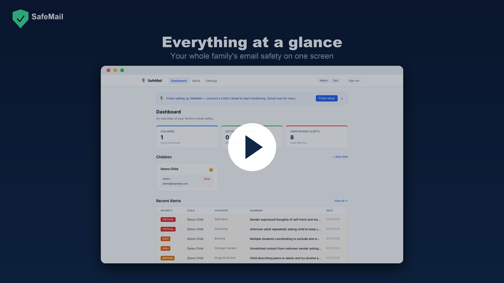

# SafeMail

**AI-powered email monitoring that gives parents peace of mind — without reading their child's mail.**

SafeMail connects to a child's Gmail account, scans incoming emails with Claude AI, and alerts a parent only when something genuinely dangerous shows up — self-harm, grooming, bullying, drugs, stranger contact, or sharing of personal information. Everyday email stays private.

## Demo

> A 27-second tour of the product — click to play.

## Why SafeMail

- **Privacy first.** Raw email text is never stored. Only an AI-generated summary and a few pieces of metadata are kept — never the original message.
- **Signal, not noise.** You don't get a notification for every email. SafeMail only speaks up when it's confident something is actually a risk.
- **Built for busy parents.** Connect an account in seconds, then forget about it until it matters.

## How it works

1. **Connect** — Link your child's Gmail account with a few taps (secure Google sign-in).
2. **Monitor** — SafeMail quietly checks for new email in the background.
3. **Understand** — Each message is read by Claude AI to judge whether it's harmful.
4. **Alert** — If a real risk is found, you get a notification and a plain-language summary of what happened and why it matters.

## What you get

- A simple dashboard showing each connected child and recent alerts
- Clear severity badges so you know what needs attention now vs. later
- Push notifications and email digests, on your schedule
- Per-child settings to tune what you want to hear about

## Detection categories

SafeMail watches for: **self-harm · grooming · bullying · drugs · stranger contact · personal-information sharing.**

## Developers

Setup, architecture, testing, and deployment details live in the **[Development Guide](docs/DEVELOPMENT.md)**.

## License

MIT — see [LICENSE](LICENSE).
